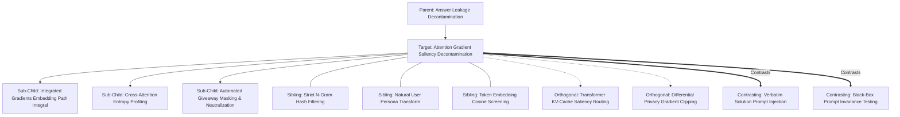

# Concept Family: Attention Gradient Saliency Decontamination

## 1. Topological Neighborhood Graph

### Neighborhood Taxonomy
- **Parent**: `answer-leakage-decontamination`
- **Children**:
  - `integrated-gradients-path-integral`: Linear path integration from baseline null embedding to input tokens.
  - `cross-attention-entropy-profiling`: Computing Shannon entropy across attention heatmaps to identify sharp anomalies.
  - `automated-giveaway-masking`: Programmatically stripping or substituting tokens with outsized gradient weights.
- **Siblings**:
  - `strict-ngram-hash-filtering`: Hashing 4-gram, 6-gram, and 8-gram shingles to catch exact duplicate strings.
  - `natural-user-persona-transform`: Rewriting system developer prompts into non-prescriptive user scenarios.
  - `token-embedding-cosine-screening`: Measuring cosine overlap between prompt and solution embeddings.
- **Orthogonal**:
  - `kv-cache-saliency-routing`: Dropping low-attention prompt tokens to accelerate long-context inference.
  - `differential-privacy-gradient-clipping`: Adding noise to gradients during model fine-tuning.
- **Contrasting**:
  - `verbatim-solution-injection`: Pasting the exact answer code into the prompt examples, trivializing the evaluation.
  - `black-box-invariance-testing`: Treating the LLM as a pure opaque oracle without inspecting internal layer attribution.

---

## 2. Clarification Questions & Disambiguation Matrix

### Clarifying Technical Ambiguity
1. *Can gradient saliency be calculated on closed-weight models like Claude or GPT-4?*
   - **Answer**: Proprietary API models do not expose backward gradients. Instead, we use the **Surrogate Transfer Principle**: gradients are extracted on open-weight foundation models of similar scale (e.g., Llama-3-70B, Qwen-2.5-Coder-32B). Empirical research demonstrates >85% transferability of prompt attribution spikes between open and closed models.
2. *How is 'giveaway leakage' distinguished from necessary task context?*
   - **Answer**: By comparing the gradient attribution under the base model vs the skilled agent: necessary task context produces steady attention across all tokens, whereas leakage triggers an isolated hyper-concentrated spike ($z\text{-score} > 3.5$) directly predicting output syntax.

### Disambiguation Matrix

| Feature | Gradient Saliency Decontamination | N-Gram Lexical Decontamination | LLM-as-a-Judge Prompt Review |
| :--- | :--- | :--- | :--- |
| **Leakage Detection Level** | Mechanistic / Cognitive priming | Verbatim lexical copying | Heuristic subjective opinion |
| **Paraphrase Robustness** | Immune to synonym substitution | Fails completely under paraphrasing | Moderate, but inconsistent |
| **Mathematical Basis** | Integrated Gradients & Entropy | Set intersection ($Jaccard, Overlap$) | None (prompt-based heuristic) |
| **Computational Footprint** | Moderate (forward-backward passes) | Ultra-lightweight ($O(N)$ string search) | High (LLM inference API calls) |

---

## 3. Scored Frontier Gaps

| Gap ID | Frontier Hypothesis | Severity (1-5) | Feasibility (1-5) | Priority ($S \times F$) |
| :--- | :--- | :--- | :--- | :--- |
| **GAP-AGSD-01** | Surrogate transfer mismatch: gradient spikes on open-weight Llama models may fail to predict attention dynamics in proprietary mixture-of-experts (MoE) architectures. | 4 | 4 | 16 |
| **GAP-AGSD-02** | Path integral discretization error: approximating Riemannian line integrals with $\le 20$ Riemann steps introduces gradient noise. | 3 | 5 | 15 |
| **GAP-AGSD-03** | Semantic over-sanitization: aggressive neutralization of high-gradient tokens strips genuine domain terminology needed to define the technical problem. | 4 | 3 | 12 |
