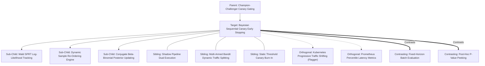

# Concept Family: Bayesian Sequential Canary Early Stopping

## 1. Topological Neighborhood Graph

### Neighborhood Taxonomy
- **Parent**: `champion-challenger-canary-gating`
- **Children**:
  - `wald-sprt-log-likelihood`: Accumulating log-odds ratios across consecutive test outcomes.
  - `dynamic-sample-reordering`: Scheduling high-probability failure probes at the head of the queue.
  - `beta-binomial-posterior`: Maintaining full credibility intervals around candidate pass rates.
- **Siblings**:
  - `shadow-pipeline-dual-execution`: Mirroring production traffic without user impact.
  - `multi-armed-bandit-traffic`: Routing user queries dynamically to maximize overall utility.
  - `static-threshold-canary-burn-in`: Running fixed 10% canary traffic for an arbitrary 24 hours.
- **Orthogonal**:
  - `kubernetes-progressive-traffic`: Infrastructure mesh controllers routing network packets.
  - `prometheus-percentile-metrics`: Time-series monitoring of service response times.
- **Contrasting**:
  - `fixed-horizon-batch`: Running all 500 test cases regardless of early catastrophic failure.
  - `post-hoc-p-value-peeking`: Halting standard t-tests informally when p < 0.05 (invalidates type I error rate).

---

## 2. Clarification Questions & Disambiguation Matrix

### Clarifying Technical Ambiguity
1. *Does early stopping invalidate the statistical rigor of our benchmarks?*
   - **Answer**: Standard t-tests or chi-square tests are invalidated by early peeking (multiplying false positives by up to 5x). In contrast, Wald's SPRT is explicitly constructed with rigorous mathematical stopping martingales, strictly guaranteeing Type I ($\alpha$) and Type II ($\beta$) error bounds regardless of when stopping occurs.
2. *What if the test cases have varying difficulties?*
   - **Answer**: By stratifying test cases into homogeneous tiers (Easy, Medium, Hard) or applying paired McNemar-based sequential scoring against the incumbent champion on the identical task instance.

### Disambiguation Matrix

| Technique | Wald SPRT Early Stopping | Fixed-Horizon Batch Test | Heuristic CI Early Bailout |
| :--- | :--- | :--- | :--- |
| **Stopping Rule** | Rigorous log-likelihood bounds | Fixed sample count $N$ | Arbitrary ("stop if 3 fail") |
| **Sample Efficiency** | Optimal (minimum ASN) | Inefficient (fixed high cost) | Uncalibrated |
| **Error Guarantees** | Exact $\alpha, \beta$ controlled | Exact $\alpha, \beta$ at horizon | Zero statistical guarantees |
| **Compute Savings** | 60% – 95% reduction | 0% reduction | High, but high false rejection |

---

## 3. Scored Frontier Gaps

| Gap ID | Frontier Hypothesis | Severity (1-5) | Feasibility (1-5) | Priority ($S \times F$) |
| :--- | :--- | :--- | :--- | :--- |
| **GAP-BSCE-01** | Non-IID autocorrelation: sequential agent evaluations may experience correlated performance drops due to shared server rate-limits or cache thrashing. | 4 | 4 | 16 |
| **GAP-BSCE-02** | Indifference zone boundary oscillation: candidate candidates whose true pass rate falls exactly between $p_0$ and $p_1$ take longer to terminate than fixed batches. | 3 | 5 | 15 |
| **GAP-BSCE-03** | Multi-metric co-optimization: extending scalar SPRT to simultaneously evaluate accuracy, latency, and token cost under sequential vector boundaries. | 5 | 2 | 10 |
