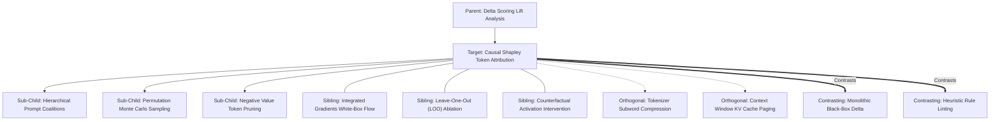

# Concept Family: Causal Shapley Token Attribution

## 1. Topological Neighborhood Graph

### Neighborhood Taxonomy
- **Parent**: `delta-scoring-lift-analysis`
- **Children**:
  - `hierarchical-prompt-coalitions`: Multi-level clustering of token spans into semantic clauses before coalition generation.
  - `permutation-monte-carlo-sampling`: Unbiased random walk orderings through the power set of instruction blocks.
  - `negative-value-token-pruning`: Programmatic excision of instructions where $\phi_i(v) < 0$.
- **Siblings**:
  - `integrated-gradients-flow`: White-box gradient path integration across token embeddings.
  - `leave-one-out-ablation`: Simple $N - 1$ ablations ignoring interaction effects among multiple instructions.
  - `counterfactual-activation-intervention`: Patching intermediate transformer activations during inference.
- **Orthogonal**:
  - `tokenizer-compression`: Byte-pair encoding efficiency and subword boundaries.
  - `kv-cache-paging`: Hardware memory layout for autoregressive attention contexts.
- **Contrasting**:
  - `monolithic-delta`: Scoring the entire prompt as pass/fail without attributing credit to specific sentences.
  - `heuristic-rule-linting`: Relying on stylistic regexes rather than empirical causal output measurements.

---

## 2. Clarification Questions & Disambiguation Matrix

### Clarifying Technical Ambiguity
1. *Why not use Leave-One-Out (LOO) instead of Shapley attribution?*
   - **Answer**: LOO fails when instructions have super-additive or sub-additive interactions. For instance, if Instruction A and Instruction B are redundant duplicates, LOO drops one and observes zero drop in performance ($LOO_A = 0, LOO_B = 0$), falsely concluding both instructions are useless. Shapley values correctly average over both present and absent states, sharing credit equally ($\phi_A = \frac{\Delta}{2}, \phi_B = \frac{\Delta}{2}$).
2. *Is Shapley computation feasible when API calls cost money?*
   - **Answer**: Yes, through hierarchical clause grouping ($|N| \le 6 \implies 64$ calls) and paired multi-task batch evaluations.

### Disambiguation Matrix

| Attribute | Causal Shapley Attribution | Leave-One-Out (LOO) | Attention Map Visualization |
| :--- | :--- | :--- | :--- |
| **Interaction Modeling** | Full non-linear interactions | Zero interaction (additive assumption) | Correlation only (not causal) |
| **Mathematical Guarantees** | Axiomatic efficiency ($\sum \phi_i = \Delta M$) | None (values sum to arbitrary total) | None |
| **Model Access** | Black-box API compatible | Black-box API compatible | White-box weights required |
| **Execution Cost** | Moderate ($O(2^K)$ or $O(K \cdot M)$) | Low ($O(K)$) | Very low ($O(1)$ forward pass) |

---

## 3. Scored Frontier Gaps

| Gap ID | Frontier Hypothesis | Severity (1-5) | Feasibility (1-5) | Priority ($S \times F$) |
| :--- | :--- | :--- | :--- | :--- |
| **GAP-CSTA-01** | Non-monotonicity under temperature: token attributions fluctuate significantly across sampling seeds when temperature $T > 0$. | 4 | 4 | 16 |
| **GAP-CSTA-02** | Positional bias distortion: instructions placed at context start/end exhibit artificially inflated Shapley values due to attention recency bias. | 4 | 3 | 12 |
| **GAP-CSTA-03** | Combinatorial explosion in multi-skill agent workflows: evaluating cross-skill instruction interactions requires exponentially large evaluation matrices. | 5 | 2 | 10 |
