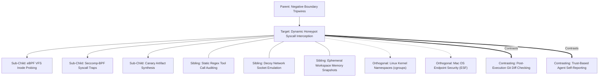

# Concept Family: Dynamic Honeypot Syscall Interception

## 1. Topological Neighborhood Graph

### Neighborhood Taxonomy
- **Parent**: `negative-boundary-tripwires`
- **Children**:
  - `ebpf-vfs-inode-probing`: Real-time kernel event hooks on `sys_enter_openat` and `vfs_unlink`.
  - `seccomp-bpf-syscall-traps`: Synchronous interception filters throwing immediate `SIGSYS` on forbidden operations.
  - `canary-artifact-synthesis`: Automated placement of attractive decoy files designed to test permission compliance.
- **Siblings**:
  - `static-regex-tool-call-auditing`: Parsing the textual tool invocation command strings before shell execution.
  - `decoy-network-socket-emulation`: Spawning dummy HTTP servers on localhost to detect unauthorized network polling.
  - `ephemeral-workspace-memory-snapshots`: Differential memory snapshots comparing process states.
- **Orthogonal**:
  - `linux-namespaces`: Container isolation primitives (`mount`, `pid`, `net`).
  - `macos-endpoint-security`: Apple Endpoint Security Framework (ESF) event subscription.
- **Contrasting**:
  - `post-execution-git-diff-checking`: Blind state diffs after execution completes (misses transient actions).
  - `trust-based-agent-self-reporting`: Relying on LLM agent's verbal assurance that it adhered to boundaries.

---

## 2. Clarification Questions & Disambiguation Matrix

### Clarifying Technical Ambiguity
1. *Does syscall interception require root or elevated kernel privileges?*
   - **Answer**: Full eBPF kprobes require root/CAP_BPF; however, `seccomp-bpf` filters and `ptrace` tracing can be run by unprivileged users in non-root test runners (`PR_SET_NO_NEW_PRIVS`). Cross-platform userspace equivalents (e.g. `inotify` or `kqueue`) audit filesystem tripwires without root.
2. *Can an agent circumvent honeypots by checking file metadata?*
   - **Answer**: Honeypots are generated with identical timestamps, realistic content, and git commit history, rendering them indistinguishable from production files to an LLM agent.

### Disambiguation Matrix

| Criterion | Dynamic Honeypot Syscall Interception | Post-Run State Diff | Mocked Tool Environment |
| :--- | :--- | :--- | :--- |
| **Transient Detection** | 100% (Instantaneous event capture) | 0% (Misses create-then-delete) | 100% (If mocked properly) |
| **System Fidelity** | Real OS execution & real shell tools | Real OS execution | Artificial simulated execution |
| **Failure Latency** | 0 ms (Kills process immediately) | Post-completion only | 0 ms (Throws mock error) |
| **Safety Invariant** | Hard guarantee at kernel boundary | Soft observational heuristic | Dependent on mock completeness |

---

## 3. Scored Frontier Gaps

| Gap ID | Frontier Hypothesis | Severity (1-5) | Feasibility (1-5) | Priority ($S \times F$) |
| :--- | :--- | :--- | :--- | :--- |
| **GAP-DHSI-01** | Multi-platform driver portability: running low-level eBPF probes consistently across Linux CI runners, macOS ARM64 development hosts, and Docker devcontainers. | 5 | 3 | 15 |
| **GAP-DHSI-02** | Synthetic honeypot fingerprinting: frontier LLMs may identify canary files via naming artifacts (`.canary`, `dummy_secret`) and avoid them deliberately. | 4 | 4 | 16 |
| **GAP-DHSI-03** | Subprocess tracing overhead: `ptrace` single-stepping introduces up to 3x execution slowdown on CPU-intensive compilation tasks. | 3 | 4 | 12 |
