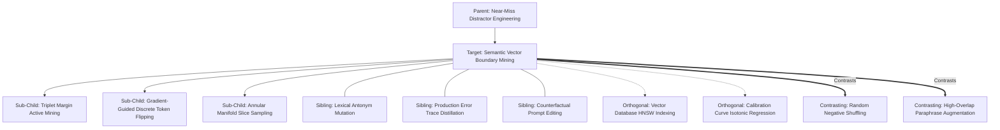

# Concept Family: Semantic Vector Boundary Mining

## 1. Topological Neighborhood Graph

### Neighborhood Taxonomy
- **Parent**: `near-miss-distractor-engineering`
- **Children**:
  - `triplet-margin-active-mining`: Iterative online active learning selecting triplets $(a, p, n)$ where $\|e_a - e_n\|_2 \approx \|e_a - e_p\|_2$.
  - `gradient-guided-token-flipping`: Projected gradient methods over vocabulary embeddings for discrete prompt perturbation.
  - `annular-manifold-slice-sampling`: High-dimensional hypersphere slicing targeting the boundary shell $[\tau - \epsilon, \tau + \epsilon]$.
- **Siblings**:
  - `lexical-antonym-mutation`: Rule-based word-swap substitutions on task verbs.
  - `production-error-trace-distillation`: Mining historic misrouted logs from production traces.
  - `counterfactual-prompt-editing`: Minimal text edits reversing user intent while keeping context intact.
- **Orthogonal**:
  - `hnsw-indexing`: Approximate nearest neighbor search efficiency in high-dimensional vector spaces.
  - `isotonic-regression-calibration`: Post-hoc probability mapping of raw cosine distances.
- **Contrasting**:
  - `random-negative-shuffling`: Picking unrelated sentences from random Wikipedia dumps as negatives.
  - `high-overlap-paraphrase-augmentation`: Generating positive test variants rather than negative boundary probes.

---

## 2. Clarification Questions & Disambiguation Matrix

### Clarifying Technical Ambiguity
1. *Does semantic vector boundary mining require white-box access to the agent's internal embedding model?*
   - **Answer**: No. While white-box access enables exact HotFlip gradients, black-box boundary mining uses zeroth-order optimization (e.g., genetic algorithms, bandit prompt perturbations, or cross-model transferability via surrogate embedding spaces such as `text-embedding-3-large`).
2. *How is oracle contamination prevented during boundary mining?*
   - **Answer**: By decoupling the generator from an ensemble LLM jury that rejects any synthesized query whose true execution trace triggers the target skill.

### Disambiguation Matrix

| Property | Semantic Vector Boundary Mining | Heuristic Near-Miss Generation | Random Negative Generation |
| :--- | :--- | :--- | :--- |
| **Search Space** | Continuous manifold $\mathcal{S}^{d-1}$ | Discrete token syntax rules | Uniform corpus sampling |
| **Boundary Proximity** | Controlled ($\cos \in [\tau-0.05, \tau)$) | Uncontrolled ($\cos \in [0.4, 0.95]$) | Distant ($\cos < 0.3$) |
| **Classifier Hardening** | Maximally sharpens decision margin | Moderately tests vocabulary | Trivial, zero diagnostic value |
| **Computational Cost** | High (vector similarity + LLM oracle) | Low (regex / LLM template) | Negligible |

---

## 3. Scored Frontier Gaps

| Gap ID | Frontier Hypothesis | Severity (1-5) | Feasibility (1-5) | Priority ($S \times F$) |
| :--- | :--- | :--- | :--- | :--- |
| **GAP-SVBM-01** | Cross-encoder boundary divergence: bi-encoder vector similarity does not correlate with cross-encoder reranker decision boundaries. | 4 | 4 | 16 |
| **GAP-SVBM-02** | Polysemous drift: adversarial token shifts accidentally cross the semantic boundary into positive intent without triggering the oracle filter. | 5 | 3 | 15 |
| **GAP-SVBM-03** | Curse of dimensionality in annular sampling: volume of spherical shell $[\tau-\epsilon, \tau]$ grows exponentially, leaving sparse angular coverage. | 3 | 4 | 12 |
