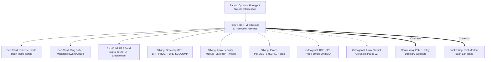

# Concept Family: eBPF VFS Kprobe and Tracepoint Harness

## 1. Topological Neighborhood Graph

### Neighborhood Taxonomy
- **Parent**: `dynamic-honeypot-syscall-interception`
- **Children**:
  - `in-kernel-inode-hash-filtering`: $O(1)$ fast path lookup of device and inode numbers in BPF map.
  - `ring-buffer-monotonic-queue`: Shared memory circular ring buffer for zero-copy delivery to user-space runner.
  - `bpf-send-signal-sigstop`: Instantaneous in-kernel process freezing on trap violation.
- **Siblings**:
  - `seccomp-bpf-progs`: User-mode syscall filtering without VFS inode resolution.
  - `lsm-bpf-probes`: Attaching to `security_file_open` hooks in kernel LSM framework.
  - `ptrace-syscall-hooks`: Classic debugging API pausing process on entry/exit of each syscall.
- **Orthogonal**:
  - `btf-vmlinux`: Portable kernel struct introspection across kernel minor versions.
  - `cgroups-v2`: Resource accounting and group process tree identification.
- **Contrasting**:
  - `polled-inotify-watchers`: Slow user-space filesystem event loops vulnerable to race conditions.
  - `post-mortem-bash-traps`: Bash `trap 'cleanup' EXIT` scripts executing only after process teardown.

---

## 2. Clarification Questions & Disambiguation Matrix

### Clarifying Technical Ambiguity
1. *Why use VFS kprobes instead of standard syscall tracepoints?*
   - **Answer**: Syscall tracepoints (`sys_enter_openat`) only see raw user-provided strings (e.g. `"./canary"`, `"../../secret"`), which require path resolution and are vulnerable to symlink aliasing. VFS kprobes (`vfs_write`, `vfs_unlink`) execute after path resolution on the actual `struct inode`, providing absolute non-forgeable file identity.
2. *Can eBPF run inside unprivileged CI devcontainers?*
   - **Answer**: Requires `CAP_BPF` or `CAP_SYS_ADMIN` capability flags, or fallback to privileged container configuration in GitHub Actions / Docker runners.

### Disambiguation Matrix

| Criterion | eBPF VFS Inode Probing | Seccomp-BPF | Userspace inotify |
| :--- | :--- | :--- | :--- |
| **Resolution Target** | Physical Inode `(dev, ino)` | Syscall number & raw registers | Canonical Path String |
| **Race Immunity** | Complete (Atomic in kernel) | Complete (Synchronous) | None (Vulnerable to time-of-check) |
| **Execution Latency** | ~4 µs | ~1 µs | 10–50 ms |
| **Symlink Evasion** | Impossible | Possible via alternate paths | Possible |

---

## 3. Scored Frontier Gaps

| Gap ID | Frontier Hypothesis | Severity (1-5) | Feasibility (1-5) | Priority ($S \times F$) |
| :--- | :--- | :--- | :--- | :--- |
| **GAP-EBPF-01** | BPF verifier complexity on pointer chasing: verifying bounded loops when extracting nested path components in older kernels. | 4 | 4 | 16 |
| **GAP-EBPF-02** | Root privilege requirement in cloud CI environments: unprivileged Docker runners refusing `CAP_BPF`. | 5 | 3 | 15 |
| **GAP-EBPF-03** | macOS Darwin absence: eBPF is Linux-specific, requiring emulation or Endpoint Security Framework on Apple Silicon. | 4 | 4 | 16 |
