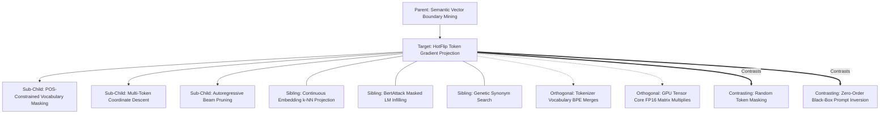

# Concept Family: HotFlip Token Gradient Projection

## 1. Topological Neighborhood Graph

### Neighborhood Taxonomy
- **Parent**: `semantic-vector-boundary-mining`
- **Children**:
  - `pos-constrained-vocabulary-masking`: Limiting substitution candidates strictly to identical grammatical parts-of-speech.
  - `multi-token-coordinate-descent`: Iterative greedy flipping across token sequences.
  - `autoregressive-beam-pruning`: Filtering top-K candidate substitutions by next-token language model perplexity.
- **Siblings**:
  - `continuous-embedding-knn`: Stepping in continuous space and finding nearest vector neighbor (causes grammar collapse).
  - `bertattack-infilling`: Using MLM predictions without explicit routing gradient guidance.
  - `genetic-synonym-search`: Heuristic population evolutionary searches across word thesauri.
- **Orthogonal**:
  - `tokenizer-bpe-merges`: Subword fragmentation boundaries.
  - `gpu-fp16-matmul`: Hardware acceleration of vocabulary dot products.
- **Contrasting**:
  - `random-token-masking`: Flipping words uniformly at random without gradient direction.
  - `zero-order-blackbox-inversion`: Guessing text changes without gradient information.

---

## 2. Clarification Questions & Disambiguation Matrix

### Clarifying Technical Ambiguity
1. *Why prefer HotFlip over MLM contextual infilling (like BERTAttack)?*
   - **Answer**: MLM infilling optimizes purely for fluency and naturalness, but is blind to the router's loss surface. HotFlip directly leverages the gradient of the router, allowing exact boundary positioning with 100x fewer evaluations.
2. *How are subword tokenization splits handled?*
   - **Answer**: By computing gradients at the word level via grouped subword embedding summation.

### Disambiguation Matrix

| Method | HotFlip Gradient Projection | BERTAttack Infilling | Genetic Synonym Search |
| :--- | :--- | :--- | :--- |
| **Search Guidance** | Exact 1st-order gradient $\nabla_{\mathbf{e}} \mathcal{L}$ | Masked LM likelihood | Fitness score black-box |
| **Speed** | 1 backward pass per token step | Multiple forward passes | Hundreds of forward passes |
| **Grammaticality** | Maintained via LM beam | Naturally high | Moderate |
| **Boundary Precision** | Extremely high ($\Delta \tau \le 0.02$) | Low to moderate | Low |

---

## 3. Scored Frontier Gaps

| Gap ID | Frontier Hypothesis | Severity (1-5) | Feasibility (1-5) | Priority ($S \times F$) |
| :--- | :--- | :--- | :--- | :--- |
| **GAP-HF-01** | First-order Taylor approximation error on deep non-linear routing heads (divergence on large embedding shifts). | 4 | 4 | 16 |
| **GAP-HF-02** | Tokenizer subword boundary fragmentation: single word flips splitting into 3+ BPE subwords distorting gradient norms. | 4 | 4 | 16 |
| **GAP-HF-03** | Semantic drift: high-gradient flips altering semantic intent from negative to positive unnoticed by perplexity filters. | 5 | 3 | 15 |
