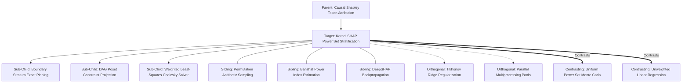

# Concept Family: Kernel SHAP Power Set Stratification

## 1. Topological Neighborhood Graph

### Neighborhood Taxonomy
- **Parent**: `causal-shapley-token-attribution`
- **Children**:
  - `boundary-stratum-exact-pinning`: Evaluating $k=1$ and $k=N-1$ coalitions exhaustively without stochastic error.
  - `dag-poset-projection`: Discarding syntactically invalid instruction combinations via DAG reachability.
  - `wls-cholesky-solver`: Numerically stable solution to normal equations $(\mathbf{Z}^T \mathbf{W} \mathbf{Z})^{-1} \mathbf{Z}^T \mathbf{W} \mathbf{y}$.
- **Siblings**:
  - `permutation-antithetic-sampling`: Pairing forward and reverse permutations to cancel variance.
  - `banzhaf-power-index`: Uniformly weighted marginal attribution without symmetry weighting.
  - `deepshap-backprop`: White-box neural network layer decomposition.
- **Orthogonal**:
  - `ridge-regularization`: Conditioning the Hessian matrix when coalitions are collinear.
  - `parallel-multiprocessing`: Concurrently executing coalition evaluations across worker threads.
- **Contrasting**:
  - `uniform-monte-carlo`: Drawing coalitions uniformly at random, starving boundary strata of samples.
  - `unweighted-regression`: Fitting linear models without Shapley kernel weights (violates efficiency axiom).

---

## 2. Clarification Questions & Disambiguation Matrix

### Clarifying Technical Ambiguity
1. *Why does uniform random sampling fail for Kernel SHAP?*
   - **Answer**: By the binomial theorem, $\binom{N}{N/2}$ contains the vast majority of binary combinations. However, the Shapley kernel places nearly infinite weight on combinations of size 1 and $N-1$. Uniform sampling starves the high-weight boundaries, causing catastrophic regression variance.
2. *How are DAG dependencies enforced mathematically?*
   - **Answer**: If node $B$ requires $A$, any coalition where $z_B = 1 \land z_A = 0$ is rejected from the sampling pool, and attribution is solved over the restricted topological poset.

### Disambiguation Matrix

| Feature | Stratified Kernel SHAP | Uniform Kernel SHAP | Permutation Monte Carlo |
| :--- | :--- | :--- | :--- |
| **Boundary Coverage** | 100% Deterministic | Stochastic / Sparse | Stochastic |
| **Variance at $M=500$** | Minimal ($\sigma < 0.02$) | High ($\sigma \approx 0.15$) | Moderate ($\sigma \approx 0.08$) |
| **DAG Awareness** | Native constraint filtering | Ignored | Requires custom topological sorters |
| **Mathematical Guarantees** | Axiomatic efficiency preserved | Efficiency preserved asymptotically | Efficiency preserved in expectation |

---

## 3. Scored Frontier Gaps

| Gap ID | Frontier Hypothesis | Severity (1-5) | Feasibility (1-5) | Priority ($S \times F$) |
| :--- | :--- | :--- | :--- | :--- |
| **GAP-KSPS-01** | Matrix singularity in sparse DAG topologies: strict dependencies leading to rank-deficient $\mathbf{Z}^T \mathbf{W} \mathbf{Z}$ matrices requiring pseudo-inversion. | 4 | 4 | 16 |
| **GAP-KSPS-02** | Non-additive clause synergy: pairs of instructions exhibiting extreme XOR behavior violating linear surrogate assumptions. | 4 | 3 | 12 |
| **GAP-KSPS-03** | API rate-limit bottlenecks: parallel evaluation of 512 stratified coalitions triggering provider throttling. | 3 | 5 | 15 |
