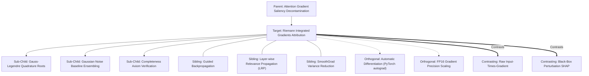

# Concept Family: Riemann Integrated Gradients Attribution

## 1. Topological Neighborhood Graph

### Neighborhood Taxonomy
- **Parent**: `attention-gradient-saliency-decontamination`
- **Children**:
  - `gauss-legendre-quadrature`: Optimal polynomial root sampling for minimal-step path integration.
  - `gaussian-noise-baseline-ensembling`: Mitigating baseline point bias via multi-baseline averaging.
  - `completeness-axiom-verification`: Validating $\sum \text{IG}_i \approx F(\mathbf{x}) - F(\mathbf{x}')$ to ensure integration convergence.
- **Siblings**:
  - `guided-backpropagation`: Modified backpropagation zeroing negative gradients (violates implementation invariance).
  - `layerwise-relevance-propagation`: Conservation-based backpropagation through layer activations.
  - `smoothgrad`: Averaging raw gradients over noisy inputs.
- **Orthogonal**:
  - `pytorch-autograd`: Reverse-mode automatic differentiation engine.
  - `fp16-gradient-scaling`: Preventing underflow during backprop through deep transformer layers.
- **Contrasting**:
  - `raw-input-times-gradient`: Subject to gradient saturation and non-linear threshold blindness.
  - `black-box-perturbation-shap`: Model-agnostic sample perturbations ignoring internal gradient flow.

---

## 2. Clarification Questions & Disambiguation Matrix

### Clarifying Technical Ambiguity
1. *Why does raw gradient attribution fail on saturated tokens?*
   - **Answer**: When an input token completely saturates an activation function (e.g. ReLU or Sigmoid threshold), the derivative $\frac{\partial F}{\partial x}$ drops to zero, making a critical token appear completely unimportant. Integrated Gradients overcomes this by accumulating gradients along the path from zero to full activation.
2. *What is the best baseline embedding for language prompts?*
   - **Answer**: An embedding of all zeros or uniform Gaussian noise $\mathcal{N}(0, 0.01)$ averaged over multiple seeds.

### Disambiguation Matrix

| Feature | Gauss-Legendre IG | Uniform Riemann IG | Raw Saliency |
| :--- | :--- | :--- | :--- |
| **Axiomatic Completeness** | $\checkmark$ Guaranteed | $\checkmark$ Asymptotically | $\times$ Fails |
| **Interpolation Steps** | 20 steps ($<0.1\%$ error) | 100 steps ($~2\%$ error) | 1 step |
| **Sensitivity Guarantee** | $\checkmark$ If feature matters, IG $\ne 0$ | $\checkmark$ | $\times$ Fails on saturation |
| **Computational Cost** | Moderate | High | Minimal |

---

## 3. Scored Frontier Gaps

| Gap ID | Frontier Hypothesis | Severity (1-5) | Feasibility (1-5) | Priority ($S \times F$) |
| :--- | :--- | :--- | :--- | :--- |
| **GAP-RIGA-01** | Path curvature non-linearity: straight-line paths passing through out-of-distribution embedding regions that distort attributions. | 4 | 3 | 12 |
| **GAP-RIGA-02** | Quadrature step variance under quantized weights (INT4/INT8): quantized weight steps introducing discontinuous gradients. | 4 | 4 | 16 |
| **GAP-RIGA-03** | Multi-token target attribution: evaluating outputs of 500+ tokens requiring path integration per generated token. | 5 | 3 | 15 |
