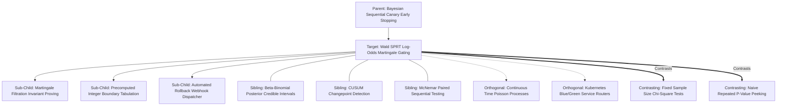

# Concept Family: Wald SPRT Log-Odds Martingale Gating

## 1. Topological Neighborhood Graph

### Neighborhood Taxonomy
- **Parent**: `bayesian-sequential-canary-early-stopping`
- **Children**:
  - `martingale-filtration-proving`: Rigorous verification that likelihood process satisfies $\mathbb{E}[L_{m+1} \mid \mathcal{F}_m] = L_m$.
  - `integer-boundary-tabulation`: Compiling line equations into lookup tables for zero-overhead CI checks.
  - `automated-rollback-dispatcher`: Immediate deployment teardown on boundary breach.
- **Siblings**:
  - `beta-binomial-credible-intervals`: Bayesian parameter density updating.
  - `cusum-changepoint`: Monitoring continuous operational streams for mean parameter shifts.
  - `mcnemar-paired-sequential`: Evaluating challenger and champion concurrently on paired identical prompts.
- **Orthogonal**:
  - `poisson-processes`: Time-arrival distributions of production requests.
  - `k8s-blue-green`: Network ingress switching mechanics.
- **Contrasting**:
  - `fixed-sample-chi-square`: Inflexible batch testing wasting sample calls on obvious regressions.
  - `naive-p-value-peeking`: Halting standard t-tests early when $p < 0.05$ (severely inflates false positive error $\alpha$).

---

## 2. Clarification Questions & Disambiguation Matrix

### Clarifying Technical Ambiguity
1. *Why does naive early stopping ruin error rates while Wald SPRT preserves them?*
   - **Answer**: Standard statistical tests assume fixed sample size $N$ set in advance. Stopping whenever $p < 0.05$ during intermediate looks gives the random walk multiple chances to cross the critical value by chance, inflating true $\alpha$ from 5% to over 25%. Wald SPRT scales the boundary lines via Doob's inequality so that the *maximum* probability of *ever* crossing the upper boundary under $H_0$ remains $\le \alpha$.
2. *What happens if test outcomes are not independent (e.g. rate limit bursts)?*
   - **Answer**: Non-independent error bursts violate the Bernoulli martingale assumption, requiring clustered sequential testing or variance inflation factors.

### Disambiguation Matrix

| Technique | Wald SPRT Martingale Gating | Naive P-Value Peeking | Fixed Horizon Testing |
| :--- | :--- | :--- | :--- |
| **Statistical Validity** | Axiomatically rigorous | Mathematically invalid (alpha leak) | Valid only at fixed $N$ |
| **Stopping Rule** | Parallel linear boundaries | P-value threshold ($p < 0.05$) | None ($m = N$) |
| **Sample Efficiency** | Maximal (Minimum ASN) | Artificially fast (spurious) | Poor |
| **Promotion Safety** | Bounded false promotion $\le \alpha$ | Unbounded false promotion | Bounded at $N$ |

---

## 3. Scored Frontier Gaps

| Gap ID | Frontier Hypothesis | Severity (1-5) | Feasibility (1-5) | Priority ($S \times F$) |
| :--- | :--- | :--- | :--- | :--- |
| **GAP-WSPRT-01** | Truncation boundary overshoot: when reaching maximum budget $M_{\max}$, linear boundaries must be truncated without distorting Type II error $\beta$. | 4 | 4 | 16 |
| **GAP-WSPRT-02** | Time-varying latent success probabilities: agent drift caused by fluctuating external dependencies violating stationary $p$ assumptions. | 4 | 3 | 12 |
| **GAP-WSPRT-03** | Multi-class outcome expansion: generalizing binary pass/fail SPRT to ordinal or continuous assertion scores ($S \in [0, 1]$). | 4 | 4 | 16 |
